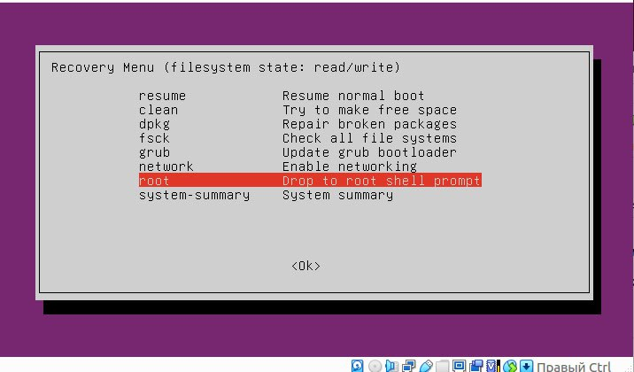
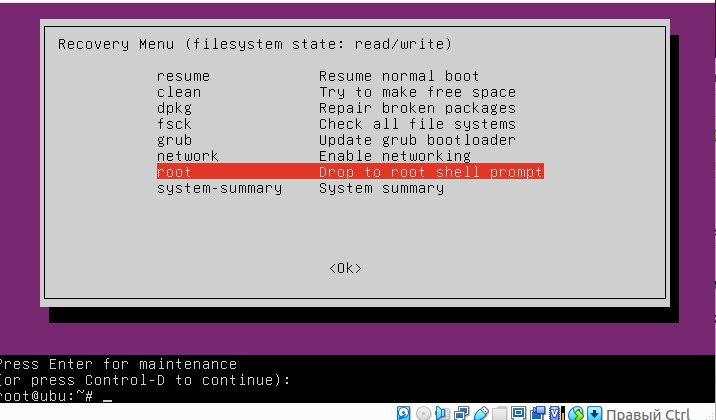
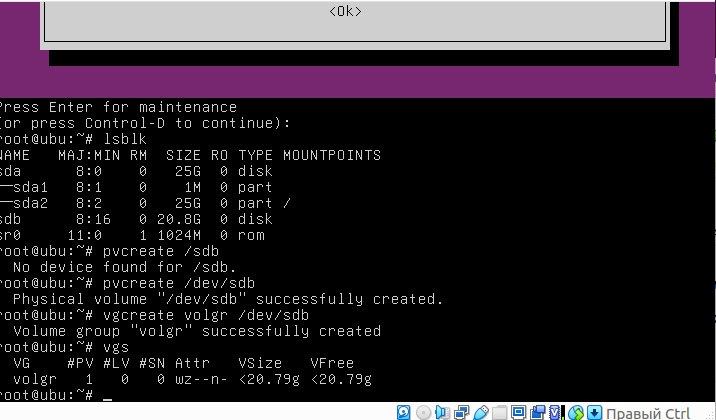
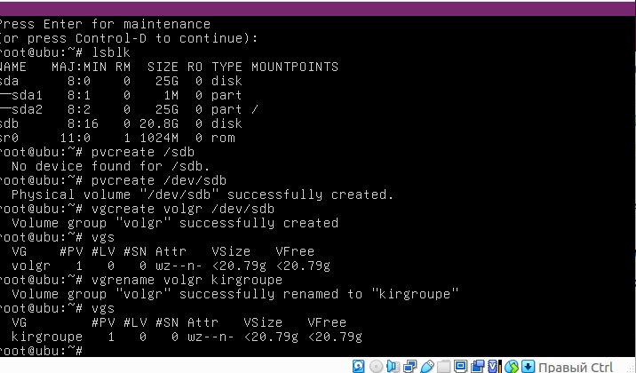

# Admin

## Домашние задания

<details>
  <summary>2. LVM-1,2</summary>
<b>Описание задания</b>

1. Настроить LVM в Ubuntu 24.04 Server
2. Создать Physical Volume, Volume Group и Logical Volume
3. Отформатировать и смонтировать файловую систему
4. Расширить файловую систему за счёт нового диска
5. Выполнить resize
6. Проверить корректность работы

**Смотрим блочные устройства**

```bash
kirill@ubuntusrv:~$ lsblk
NAME   MAJ:MIN RM  SIZE RO TYPE MOUNTPOINTS
sda      8:0    0   25G  0 disk 
├─sda1   8:1    0    1M  0 part 
└─sda2   8:2    0   25G  0 part /
sdb      8:16   0 20,8G  0 disk 
sdc      8:32   0   11G  0 disk 
sdd      8:48   0  5,4G  0 disk 
sde      8:64   0  5,4G  0 disk 
sr0     11:0    1 1024M  0 rom  
```

**Создаем logical volume(lv_root) в volume groupe(vg_root) на physical volume(sdb)**

```bash
kirill@ubuntusrv:~$ sudo pvcreate /dev/sdb
[sudo] password for kirill: 
  Physical volume "/dev/sdb" successfully created.
kirill@ubuntusrv:~$ sudo vgcreate vg_root /dev/sdb
  Volume group "vg_root" successfully created
kirill@ubuntusrv:~$ sudo lvcreate -n lv_root -l +100%FREE /dev/vg_root 
  Logical volume "lv_root" created.
```

**Создаём файловую систему в lv_root, монтируем ее в каталог /mnt  и копируем все из корня в нее**

```bash
kirill@ubuntusrv:~$ sudo mkfs.ext4 /dev/vg_root/lv_root
mke2fs 1.47.0 (5-Feb-2023)
Creating filesystem with 5448704 4k blocks and 1362720 inodes
Filesystem UUID: 303d2ecf-3a3d-47c9-8056-a7368ceda85d
Superblock backups stored on blocks: 
	32768, 98304, 163840, 229376, 294912, 819200, 884736, 1605632, 2654208, 
	4096000

Allocating group tables: done                            
Writing inode tables: done                            
Creating journal (32768 blocks): done
Writing superblocks and filesystem accounting information: done   

kirill@ubuntusrv:~$ sudo mount /dev/vg_root/lv_root /mnt
kirill@ubuntusrv:~$ rsync -avxHAX --progress / /mnt/ # a(сохраняет все права и метки) v(отображает все копируемые файлы) x(не затрагивает другие фс) H(сохраняет жесткие ссылки) A(сохраняет все права) X(сохраняет расширенные атрибуты) --progress(отображает линию прогресса)
sent 2.492.961.262 bytes  received 1.582.425 bytes  17.629.284,01 bytes/sec
total size is 2.490.743.922  speedup is 1,00
kirill@ubuntusrv:~$ ls /mnt
bin                dev   lib64              mnt   run                 srv  var
bin.usr-is-merged  etc   lib.usr-is-merged  opt   sbin                sys
boot               home  lost+found         proc  sbin.usr-is-merged  tmp
cdrom              lib   media              root  snap                usr
```

**Создаем критические папки в /mnt и монтируем их с системными. Далее делаем /mnt корневым каталогом и создаем новый grub-файл. После чего обновляем initramfs это необходимо для старта системы**

```bash
kirill@ubuntusrv:~$ sudo bash -c 'mkdir -p /mnt/{proc,sys,dev,run,boot}; for i in /proc/ /sys/ /dev/ /run/ /boot/; do mount --bind "$i" "/mnt$i"; done'
kirill@ubuntusrv:~$ sudo chroot /mnt/
root@ubuntusrv:/# grub-mkconfig -o /boot/grub/grub.cfg
Sourcing file `/etc/default/grub'
Generating grub configuration file ...
Found linux image: /boot/vmlinuz-6.8.0-60-generic
Found initrd image: /boot/initrd.img-6.8.0-60-generic
Warning: os-prober will not be executed to detect other bootable partitions.
Systems on them will not be added to the GRUB boot configuration.
Check GRUB_DISABLE_OS_PROBER documentation entry.
Adding boot menu entry for UEFI Firmware Settings ...
done
root@ubuntusrv:/# update-initramfs -u
update-initramfs: Generating /boot/initrd.img-6.8.0-60-generic
root@ubuntusrv:/# exit
exit
kirill@ubuntusrv:~$ sudo reboot
```

**Проверяем после reboot**

```bash
kirill@192.168.1.18's password: 
Welcome to Ubuntu 24.04.2 LTS (GNU/Linux 6.8.0-60-generic x86_64)
kirill@ubuntusrv:~$ lsblk
NAME              MAJ:MIN RM  SIZE RO TYPE MOUNTPOINTS
sda                 8:0    0   25G  0 disk 
├─sda1              8:1    0    1M  0 part 
└─sda2              8:2    0   25G  0 part 
sdb                 8:16   0 20,8G  0 disk 
└─vg_root-lv_root 252:0    0 20,8G  0 lvm  /
sdc                 8:32   0   11G  0 disk 
sdd                 8:48   0  5,4G  0 disk 
sde                 8:64   0  5,4G  0 disk 
sr0                11:0    1 1024M  0 rom  
```

**Удаляем LV(начальный*) и создем его же размером 8G и делаем все то же самое, что выше**
*Я забыл в начале создать LVM на sda2

```bash
kirill@ubuntusrv:~$ lvremove /dev/ubuntu-vg/ubuntu-lv
Do you really want to remove and DISCARD active logical volume ubuntu-vg/ubuntu-lv? [y/n]: y
  Logical volume "ubuntu-lv" successfully removed.

kirill@ubuntusrv:~$ lvcreate -n ubuntu-vg/ubuntu-lv -L 8G /dev/ubuntu-vg
WARNING: ext4 signature detected on /dev/ubuntu-vg/ubuntu-lv at offset 1080. Wipe it? [y/n]: y
  Wiping ext4 signature on /dev/ubuntu-vg/ubuntu-lv.
  Logical volume "ubuntu-lv" created.
```

**Далее пробуем создать зеркало из sdc, sdd**

```bash
kirill@ubuntusrv:~$ sudo pvcreate /dev/sdc /sev/sdd
  No device found for /sev/sdd.
  Physical volume "/dev/sdc" successfully created.
kirill@ubuntusrv:~$ sudo pvcreate /dev/sdd
  Physical volume "/dev/sdd" successfully created.
kirill@ubuntusrv:~$ sudo vgcreate vg_var /dev/sdc /dev/sdd
  Volume group "vg_var" successfully created
kirill@ubuntusrv:~$ sudo lvcreate -L 950M -m1 -n lv_var vg_var
  Rounding up size to full physical extent 952,00 MiB
  Logical volume "lv_var" created.
```

**Создаем файловую систему**

```bash
kirill@ubuntusrv:~$ sudo mkfs.ext4 /dev/vg_var/lv_var
mke2fs 1.47.0 (5-Feb-2023)
Creating filesystem with 243712 4k blocks and 60928 inodes
Filesystem UUID: afaafe5d-60ea-4b81-bbad-ff990f404d08
Superblock backups stored on blocks: 
	32768, 98304, 163840, 229376

Allocating group tables: done                            
Writing inode tables: done                            
Creating journal (4096 blocks): done
Writing superblocks and filesystem accounting information: done
```

**Далее монтируем LV в /mnt и копируем все файлы. Перемещаем старый var в отдельную папку. Размонтируем м монтируем LV в /var. Извлекаем uid и добавляем его в конец fstab**

```bash
kirill@ubuntusrv:~$ sudo mount /dev/vg_var/lv_var /mnt
kirill@ubuntusrv:~$ sudo cp  -aR /var/* /mnt/
kirill@ubuntusrv:~$ sudo mkdir /tmp/oldvar && sudo mv /var/* /tmp/oldvar
kirill@ubuntusrv:~$ sudo umount /mnt
kirill@ubuntusrv:~$ sudo mount /dev/vg_var/lv_var /var 
kirill@ubuntusrv:~$ sudo bash -c 'echo "`blkid | grep var: | awk \"{print \$2}\"` /var ext4 defaults 0 0" >> /etc/fstab'
kirill@ubuntusrv:~$ lvremove /dev/vg_root/lv_root
kirill@ubuntusrv:~$ vgremove /dev/vg_root
kirill@ubuntusrv:~$ pvremove /dev/sdb
```
**Работа со снэпшотами**
**Создаем 20файлов в /mnt**

```bash
kirill@ubu:~$ ls /mnt
bin                dev   lib64              mnt   run                 srv  var
bin.usr-is-merged  etc   lib.usr-is-merged  opt   sbin                sys
boot               home  lost+found         proc  sbin.usr-is-merged  tmp
cdrom              lib   media              root  snap                usr
kirill@ubu:~$ ls
kirill@ubu:~$ lsblk
NAME                MAJ:MIN RM  SIZE RO TYPE MOUNTPOINTS
sda                   8:0    0   25G  0 disk 
├─sda1                8:1    0    1M  0 part 
└─sda2                8:2    0   25G  0 part /
sdb                   8:16   0  7,2G  0 disk 
└─vg--home-lv--home 252:0    0  5,8G  0 lvm  /mnt
sdc                   8:32   0  8,2G  0 disk 
sr0                  11:0    1 1024M  0 rom  
kirill@ubu:~$ sudo touch /mnt/file{1..20}
kirill@ubu:~$ ls /mnt
bin                file11  file19  file8              mnt                 srv
bin.usr-is-merged  file12  file2   file9              opt                 sys
boot               file13  file20  home               proc                tmp
cdrom              file14  file3   lib                root                usr
dev                file15  file4   lib64              run                 var
etc                file16  file5   lib.usr-is-merged  sbin
file1              file17  file6   lost+found         sbin.usr-is-merged
file10             file18  file7   media              snap
```

**Делаем снэпшот и удаляем половину файлов** 

```bash
kirill@ubu:~$ sudo lvcreate -L 100MB -s -n mnt_sanp /dev/vg-home/lv-home
  Logical volume "mnt_sanp" created.
kirill@ubu:~$ lsblk
NAME                     MAJ:MIN RM  SIZE RO TYPE MOUNTPOINTS
sda                        8:0    0   25G  0 disk 
├─sda1                     8:1    0    1M  0 part 
└─sda2                     8:2    0   25G  0 part /
sdb                        8:16   0  7,2G  0 disk 
├─vg--home-lv--home-real 252:1    0  5,8G  0 lvm  
│ ├─vg--home-lv--home    252:0    0  5,8G  0 lvm  /mnt
│ └─vg--home-mnt_sanp    252:3    0  5,8G  0 lvm  
└─vg--home-mnt_sanp-cow  252:2    0  100M  0 lvm  
  └─vg--home-mnt_sanp    252:3    0  5,8G  0 lvm  
sdc                        8:32   0  8,2G  0 disk 
sr0                       11:0    1 1024M  0 rom  
kirill@ubu:~$ sudo rm -f /mnt/file{11..20}
```

***Отсоединяем /mnt, мержим со снэпом и монтируем в /mnt**

```bash
kirill@ubu:~$ sudo umount /mnt
kirill@ubu:~$ lsblk
NAME                     MAJ:MIN RM  SIZE RO TYPE MOUNTPOINTS
sda                        8:0    0   25G  0 disk 
├─sda1                     8:1    0    1M  0 part 
└─sda2                     8:2    0   25G  0 part /
sdb                        8:16   0  7,2G  0 disk 
├─vg--home-lv--home-real 252:1    0  5,8G  0 lvm  
│ ├─vg--home-lv--home    252:0    0  5,8G  0 lvm  
│ └─vg--home-mnt_sanp    252:3    0  5,8G  0 lvm  
└─vg--home-mnt_sanp-cow  252:2    0  100M  0 lvm  
  └─vg--home-mnt_sanp    252:3    0  5,8G  0 lvm  
sdc                        8:32   0  8,2G  0 disk 
sr0                       11:0    1 1024M  0 rom  
kirill@ubu:~$ sudo lvconvert --merge /dev/vg-home/mnt_sanp
  Merging of volume vg-home/mnt_sanp started.
  vg-home/lv-home: Merged: 100,00%
kirill@ubu:~$ lsblk
NAME                MAJ:MIN RM  SIZE RO TYPE MOUNTPOINTS
sda                   8:0    0   25G  0 disk 
├─sda1                8:1    0    1M  0 part 
└─sda2                8:2    0   25G  0 part /
sdb                   8:16   0  7,2G  0 disk 
└─vg--home-lv--home 252:0    0  5,8G  0 lvm  
sdc                   8:32   0  8,2G  0 disk 
sr0                  11:0    1 1024M  0 rom  
kirill@ubu:~$ sudo mount /dev/mapper/vg--home-lv--home /mnt
```

**Проверяем и видим то все востановилось**

```bash
kirill@ubu:~$ ls -al /mnt
total 104
drwxr-xr-x  23 root root  4096 мая 20 20:59 .
drwxr-xr-x  23 root root  4096 мая 20 20:17 ..
lrwxrwxrwx   1 root root     7 апр 22  2024 bin -> usr/bin
drwxr-xr-x   2 root root  4096 фев 26  2024 bin.usr-is-merged
drwxr-xr-x   3 root root  4096 мая 20 20:22 boot
dr-xr-xr-x   2 root root  4096 мая 20 20:16 cdrom
drwxr-xr-x   2 root root  4096 мая 20 20:46 dev
drwxr-xr-x 108 root root  4096 мая 20 20:37 etc
-rw-r--r--   1 root root     0 мая 20 20:59 file1
-rw-r--r--   1 root root     0 мая 20 20:59 file10
-rw-r--r--   1 root root     0 мая 20 20:59 file11
-rw-r--r--   1 root root     0 мая 20 20:59 file12
-rw-r--r--   1 root root     0 мая 20 20:59 file13
-rw-r--r--   1 root root     0 мая 20 20:59 file14
-rw-r--r--   1 root root     0 мая 20 20:59 file15
-rw-r--r--   1 root root     0 мая 20 20:59 file16
-rw-r--r--   1 root root     0 мая 20 20:59 file17
-rw-r--r--   1 root root     0 мая 20 20:59 file18
-rw-r--r--   1 root root     0 мая 20 20:59 file19
-rw-r--r--   1 root root     0 мая 20 20:59 file2
-rw-r--r--   1 root root     0 мая 20 20:59 file20
-rw-r--r--   1 root root     0 мая 20 20:59 file3
-rw-r--r--   1 root root     0 мая 20 20:59 file4
-rw-r--r--   1 root root     0 мая 20 20:59 file5
-rw-r--r--   1 root root     0 мая 20 20:59 file6
-rw-r--r--   1 root root     0 мая 20 20:59 file7
-rw-r--r--   1 root root     0 мая 20 20:59 file8
-rw-r--r--   1 root root     0 мая 20 20:59 file9
drwxr-xr-x   3 root root  4096 мая 20 20:29 home
lrwxrwxrwx   1 root root     7 апр 22  2024 lib -> usr/lib
lrwxrwxrwx   1 root root     9 апр 22  2024 lib64 -> usr/lib64
drwxr-xr-x   2 root root  4096 фев 26  2024 lib.usr-is-merged
drwx------   2 root root 16384 мая 20 20:17 lost+found
drwxr-xr-x   2 root root  4096 фев 16 20:51 media
drwxr-xr-x   2 root root  4096 мая 20 20:47 mnt
drwxr-xr-x   2 root root  4096 фев 16 20:51 opt
dr-xr-xr-x   2 root root  4096 мая 20 20:41 proc
drwx------   3 root root  4096 мая 20 20:28 root
drwxr-xr-x   2 root root  4096 мая 20 20:42 run
lrwxrwxrwx   1 root root     8 апр 22  2024 sbin -> usr/sbin
drwxr-xr-x   2 root root  4096 авг 22  2024 sbin.usr-is-merged
drwxr-xr-x   2 root root  4096 мая 20 20:29 snap
drwxr-xr-x   2 root root  4096 фев 16 20:51 srv
dr-xr-xr-x   2 root root  4096 мая 20 20:41 sys
drwxrwxrwt  12 root root  4096 мая 20 20:42 tmp
drwxr-xr-x  12 root root  4096 фев 16 20:51 usr
drwxr-xr-x  13 root root  4096 мая 20 20:29 var
```
</details>
<details>
  <summary>4. NFS</summary>

**Устанавливаем пакеты на пк и сервер**
```bash
sudo apt install nfs-kernel-server для сервера и sudo apt install nfs-common для клиента
```

**проверяем открытые порты 2049 и 111 на сервере**
```bash
kirill@ubuntupc:~$ ss -tnplu
```

**Создаем дирректорию для дальнейшего экспорта**
```bash
kirill@ubuntupc:~$ cd /etc
kirill@ubuntupc:/etc$ sudo mkdir -p /srv/share/upload #-p проверяет наличие уже созданной такой папки
```

**настраиваем права доступа**
```bash
kirill@ubuntupc:/etc$ sudo chown -R nobody:nogroup /srv/share # рекурсивно меняем группу и пользователя на минимальные права
kirill@ubuntupc:/etc$ sudo chmod 0777 /srv/share/upload # устанавливаем максимальные права на /upload
```

**Делаем запись на разрешения экспорта**
```bash
kirill@ubuntupc:/etc$ sudo vim /etc/exports
#и добавляем в конец строчку
#/srv/share 192.168.50.11/32(rw,sync,root_squash)
```

**Перезагружаем таблицу экспорта**
```bash
kirill@ubuntupc:/etc$ sudo exportfs -r
exportfs: /etc/exports [1]: Neither 'subtree_check' or 'no_subtree_check' specified for export "192.168.1.6/32:/srv/share/".
  Assuming default behaviour ('no_subtree_check').
  NOTE: this default has changed since nfs-utils version 1.0.x
```

**выводим таблицу для проверки**
```bash
kirill@ubuntupc:/etc$ sudo exportfs -s
/srv/share  192.168.1.6/32(sync,wdelay,hide,no_subtree_check,sec=sys,rw,secure,root_squash,no_all_squash)
```

**<b>Настраиваем клиента</b>**
```bash
Добавляем запись в fstab
kirill@ubuntu:~$ sudo bash -c " echo '192.168.1.7:/srv/share/ /mnt nfs vers=3,noauto,x-systemd.automount 0 0' >> /etc/fstab"
```

**в данном случае происходит автоматическая генерация systemd units в каталоге /run/systemd/generator/, которые производят монтирование при первом обращении к каталогу /mnt**
```bash
kirill@ubuntu:~$ systemctl daemon-reload
==== AUTHENTICATING FOR org.freedesktop.systemd1.reload-daemon ====
Чтобы заставить systemd перечитать конфигурацию, необходимо пройти аутентификацию.
Authenticating as: kirill
Password: 
==== AUTHENTICATION COMPLETE ====
kirill@ubuntu:~$ systemctl restart remote-fs.target
==== AUTHENTICATING FOR org.freedesktop.systemd1.manage-units ====
Чтобы перезапустить «remote-fs.target», необходимо пройти аутентификацию.
Authenticating as: kirill
Password: 
==== AUTHENTICATION COMPLETE ====

kirill@ubuntu:~$ ls /mnt #ls/mnt потому что монтируется только при обращении из за x-systemd.automount
upload
kirill@ubuntu:~$ mount | grep mnt
nsfs on /run/snapd/ns/snapd-desktop-integration.mnt type nsfs (rw)
nsfs on /run/snapd/ns/firmware-updater.mnt type nsfs (rw)
systemd-1 on /mnt type autofs (rw,relatime,fd=90,pgrp=1,timeout=0,minproto=5,maxproto=5,direct,pipe_ino=25751)
192.168.1.7:/srv/share/ on /mnt type nfs (rw,relatime,vers=3,rsize=1048576,wsize=1048576,namlen=255,hard,proto=tcp,timeo=600,retrans=2,sec=sys,mountaddr=192.168.1.7,mountvers=3,mountport=54122,mountproto=udp,local_lock=none,addr=192.168.1.7)
```

**Проверяем работоспособность**
```bash
#server
kirill@ubuntupc:/srv/share$ sudo touch checkfile
[sudo] password for kirill: 
kirill@ubuntupc:/srv/share$ 
checkfile upload

#client
kirill@ubuntu:~$ ls /mnt
checkfile  upload
kirill@ubuntu:~$ sudo touch /mnt/client_file
[sudo] пароль для kirill: 
kirill@ubuntu:~$ ls /mnt
checkfile  client_file  upload
kirill@ubuntu:~$ sudo reboot

Broadcast message from root@ubuntu on pts/2 (Mon 2025-05-26 19:53:35 UTC):

The system will reboot now!

eroticer@eroticer-Nitro-AN515-55:~$ ssh kirill@192.168.1.6
kirill@192.168.1.6's password: 
Welcome to Ubuntu 24.04.2 LTS (GNU/Linux 6.11.0-26-generic x86_64)

 * Documentation:  https://help.ubuntu.com
 * Management:     https://landscape.canonical.com
 * Support:        https://ubuntu.com/pro

Расширенное поддержание безопасности (ESM) для Applications выключено.

110 обновлений может быть применено немедленно.
Чтобы просмотреть дополнительные обновления выполните: apt list --upgradable

Включите ESM Apps для получения дополнительных будущих обновлений безопасности.
Смотрите https://ubuntu.com/esm или выполните: sudo pro status

Last login: Sun May 25 20:11:56 2025 from 192.168.1.4
kirill@ubuntu:~$ ls /mnt
checkfile  client_file  upload
```
```bash
#server

kirill@ubuntupc:/srv/share$ sudo reboot

Broadcast message from root@ubuntupc on pts/1 (Mon 2025-05-26 20:00:40 UTC):

The system will reboot now!

kirill@ubuntupc:/srv/share$ Connection to 192.168.1.7 closed by remote host.
Connection to 192.168.1.7 closed.
eroticer@eroticer-Nitro-AN515-55:~$ ssh kirill@192.168.1.7
kirill@192.168.1.7's password: 
Welcome to Ubuntu 24.04.2 LTS (GNU/Linux 6.8.0-60-generic x86_64)

 * Documentation:  https://help.ubuntu.com
 * Management:     https://landscape.canonical.com
 * Support:        https://ubuntu.com/pro

 System information as of Пн 26 мая 2025 20:01:58 UTC

  System load:             1.82
  Usage of /:              10.4% of 24.44GB
  Memory usage:            2%
  Swap usage:              0%
  Processes:               136
  Users logged in:         0
  IPv4 address for enp0s3: 192.168.1.7
  IPv6 address for enp0s3: 2a00:1370:8192:5f39:a00:27ff:fe13:8c55


Расширенное поддержание безопасности (ESM) для Applications выключено.

63 обновления может быть применено немедленно.
Чтобы просмотреть дополнительные обновления выполните: apt list --upgradable

Включите ESM Apps для получения дополнительных будущих обновлений безопасности.
Смотрите https://ubuntu.com/esm или выполните: sudo pro status


Last login: Sun May 25 20:11:05 2025 from 192.168.1.4
kirill@ubuntupc:~$ ls /srv/share/
checkfile  client_file  upload
```
</details>

<details>
    <summary>5. Управление пакетами</summary>

-------------------------------------------------------------------------------------------
ALMA LIN
-------------------------------------------------------------------------------------------		

**Устанавливаем все необходимые пакеты**
```bash
[root@localhost ~]# yum install wget -y rpmdevtools rpm-build createrepo yum-utils cmake gcc git vim
Complete!
[root@localhost ~]# mkdir rpm && cd rpm
[root@localhost rpm]# yumdownloader --source nginx #SRPM пакет
enabling appstream-source repository
enabling baseos-source repository
enabling extras-source repository
AlmaLinux 10 - AppStream - Source               245 kB/s | 480 kB     00:01    
AlmaLinux 10 - BaseOS - Source                   95 kB/s | 171 kB     00:01    
AlmaLinux 10 - Extras - Source                  1.1 kB/s | 1.9 kB     00:01    
nginx-1.26.3-1.el10.src.rpm                     1.0 MB/s | 1.3 MB     00:01
```

**Ставим зависимости**
```bash
[root@localhost rpm]# rpm -Uvh nginx*.src.rpm
Updating / installing...
   1:nginx-2:1.26.3-1.el10            ################################# [100%]
[root@localhost rpm]# yum-builddep nginx
Complete!
```

**Скачиваем и собираем модуль brotli**
```bash
[root@localhost rpm]# cd /root
[root@localhost ~]# git clone --recurse-submodules -j8 https://github.com/google/ngx_brotli
[root@localhost ~]# cd ngx_brotli/deps/brotli
[root@localhost brotli]# mkdir out && cd out
[root@localhost out]# cmake -DCMAKE_BUILD_TYPE=Release -DBUILD_SHARED_LIBS=OFF -DCMAKE_C_FLAGS="-Ofast -m64 -march=native -mtune=native -flto -funroll-loops -ffunction-sections -fdata-sections -Wl,--gc-sections" -DCMAKE_CXX_FLAGS="-Ofast -m64 -march=native -mtune=native -flto -funroll-loops -ffunction-sections -fdata-sections -Wl,--gc-sections" -DCMAKE_INSTALL_PREFIX=./installed ..
[root@localhost out]# cmake --build . --config Release -j 2 --target brotlienc
[100%] Built target brotlienc
```

**Добавляем модуль brotli в конфигурации (nginx.spec) и собираем пакет**
```bash
[root@localhost ~]# vim ~/rpmbuild/SPECS/nginx.spec
[root@localhost ~]# rpmbuild -ba nginx.spec -D 'debug_package %{nil}'
Executing(%clean): /bin/sh -e /var/tmp/rpm-tmp.BfOZTZ
+ umask 022
+ cd /root/rpmbuild/BUILD
+ cd nginx-1.26.3
+ /usr/bin/rm -rf /root/rpmbuild/BUILDROOT/nginx-1.26.3-1.el10.x86_64
+ RPM_EC=0
++ jobs -p
+ exit 0
Executing(rmbuild): /bin/sh -e /var/tmp/rpm-tmp.ljiRzK
+ umask 022
+ cd /root/rpmbuild/BUILD
+ rm -rf /root/rpmbuild/BUILD/nginx-1.26.3-SPECPARTS
+ rm -rf nginx-1.26.3 nginx-1.26.3.gemspec
+ RPM_EC=0
++ jobs -p
+ exit 0

[root@localhost x86_64]# ll
total 2260
-rw-r--r--. 1 root root   33138 Jun  1 14:00 nginx-1.26.3-1.el10.x86_64.rpm
```

**Проверяем работу**
```bash
[root@localhost x86_64]# cp ~/rpmbuild/RPMS/noarch/* ~/rpmbuild/RPMS/x86_64/
[root@localhost x86_64]# yum localinstall *.rpm
Complete!
[root@localhost x86_64]# systemctl start nginx
[root@localhost x86_64]# sysyemctl status nginx
-bash: sysyemctl: command not found
[root@localhost x86_64]# systemctl status nginx
● nginx.service - The nginx HTTP and reverse proxy server
     Loaded: loaded (/usr/lib/systemd/system/nginx.service; disabled; preset: d>
     Active: active (running) since Sun 2025-06-01 14:47:20 MSK; 22s ago
 Invocation: 39ac2f2d50b64f87889ef19b18d68bcb
    Process: 11324 ExecStartPre=/usr/bin/rm -f /run/nginx.pid (code=exited, sta>
    Process: 11326 ExecStartPre=/usr/sbin/nginx -t (code=exited, status=0/SUCCE>
    Process: 11328 ExecStart=/usr/sbin/nginx (code=exited, status=0/SUCCESS)
   Main PID: 11329 (nginx)
      Tasks: 3 (limit: 53272)
     Memory: 4.9M (peak: 4.9M)
        CPU: 105ms
     CGroup: /system.slice/nginx.service
             ├─11329 "nginx: master process /usr/sbin/nginx"
             ├─11330 "nginx: worker process"
             └─11331 "nginx: worker process"

Jun 01 14:47:20 localhost.localdomain systemd[1]: Starting nginx.service - The >
Jun 01 14:47:20 localhost.localdomain nginx[11326]: nginx: the configuration fi>
Jun 01 14:47:20 localhost.localdomain nginx[11326]: nginx: configuration file />
Jun 01 14:47:20 localhost.localdomain systemd[1]: Started nginx.service - The n>
[root@localhost x86_64]# 
```

**Создаем репозиторий и копируем туда пакеты**
```bash
[root@localhost x86_64]# mkdir /usr/share/nginx/html/repo
[root@localhost x86_64]# cp ~/rpmbuild/RPMS/x86_64/*.rpm /usr/share/nginx/html/repo/
[root@localhost x86_64]# createrepo /usr/share/nginx/html/repo/
Directory walk started
Directory walk done - 10 packages
Temporary output repo path: /usr/share/nginx/html/repo/.repodata/
Pool started (with 5 workers)
Pool finished
```

**Добавляем директивы и перезапускаем сервер**
```bash
[root@localhost x86_64]# vim /etc/nginx/nginx.conf

 server {
        listen       80;
        listen       [::]:80;
        server_name  _;
        root         /usr/share/nginx/html;
        index index.html index.htm; #Добавляем эту строку
        autoindex on; #и эту
        # Load configuration files for the default server block.
        include /etc/nginx/default.d/*.conf;
    }

[root@localhost x86_64]# nginx -t
nginx: the configuration file /etc/nginx/nginx.conf syntax is ok
nginx: configuration file /etc/nginx/nginx.conf test is successful
[root@localhost x86_64]# nginx -s reload

[root@localhost x86_64]# curl -a http://localhost/repo
<html>
<head><title>301 Moved Permanently</title></head>
<body>
<center><h1>301 Moved Permanently</h1></center>
<hr><center>nginx/1.26.3</center>
</body>
</html>
```
**Подключаем репозиторий и обновляем спиок пакетов**
```bash
[root@localhost x86_64]# cat >> /etc/yum.repos.d/otus.repo << EOF
> [otus]
> name=otus-linux
> baseurl=http://localhost/repo
> gpgcheck=0
> enabled=1
> EOF

[root@localhost x86_64]# yum repolist enabled | grep otus
otus                             otus-linux

[root@localhost x86_64]# yum install -y https://repo.percona.com/yum/percona-release-latest.noarch.rpm
Last metadata expiration check: 0:03:05 ago on Sun Jun  1 16:22:19 2025.
percona-release-latest.noarch.rpm                46 kB/s |  28 kB     00:00    
Dependencies resolved.
================================================================================
 Package                Architecture  Version         Repository           Size
================================================================================
Installing:
 percona-release        noarch        1.0-30          @commandline         28 k

Transaction Summary
================================================================================
Install  1 Package

Total size: 28 k
Installed size: 49 k
Downloading Packages:
Running transaction check
Transaction check succeeded.
Running transaction test
Transaction test succeeded.
Running transaction
  Preparing        :                                                        1/1 
  Installing       : percona-release-1.0-30.noarch                          1/1 
  Running scriptlet: percona-release-1.0-30.noarch                          1/1 
Specified repository is not supported for current operating system!
Specified repository is not supported for current operating system!
Specified repository is not supported for current operating system!
The percona-release package now contains a percona-release script that can enable additional repositories for our newer products.

Note: currently there are no repositories that contain Percona products or distributions enabled. We recommend you to enable Percona Distribution repositories instead of individual product repositories, because with the Distribution you will get not only the database itself but also a set of other componets that will help you work with your database.

For example, to enable the Percona Distribution for MySQL 8.0 repository use:

  percona-release setup pdps8.0

Note: To avoid conflicts with older product versions, the percona-release setup command may disable our original repository for some products.

For more information, please visit:
  https://docs.percona.com/percona-software-repositories/percona-release.html


Installed:
  percona-release-1.0-30.noarch                                                 

Complete!
[root@localhost x86_64]# createrepo /usr/share/nginx/html/repo
Directory walk started
Directory walk done - 10 packages
Temporary output repo path: /usr/share/nginx/html/repo/.repodata/
Pool started (with 5 workers)
Pool finished
```
</details>
<details>
  <summary>Загрузка системы</summary>
Меняем настройки граб и перезагружаем комп

```bash
kir@ubu:~# sudo vim /etc/default/grub
#коментирум строку GRUB_TIMEOUT_STYLE=hidden
#увеличиваем время видимости GRUB_TIMEOUT=10
kir@ubu:~# sudo update-grub
kir@ubu:~# reboot
```

Далее выбираем пункт: **Advanced options for Ubuntu*

  

Тут включам сеть и переходим в root

  

Далее Создаем VG и менякм ее имя

  

  
</details>
<details>

<summary>Инициализация</summary>

**Устанавливаем logger**
```bash
kirill@ubuntu:~$ sudo apt install -y bsdutils
Чтение списков пакетов… Готово
Построение дерева зависимостей… Готово
Чтение информации о состоянии… Готово         
Уже установлен пакет bsdutils самой новой версии (1:2.39.3-9ubuntu6.2).
Обновлено 0 пакетов, установлено 0 новых пакетов, для удаления отмечено 0 пакетов, и 1 пакетов не обновлено.
```

**Создаем конфигурационный файл**
```bash
kirill@ubuntu:~$ sudo mkdir -p /etc/default
kirill@ubuntu:~$ sudo tee /etc/default/watchlog <<'EOF'
> WORD="ALERT"
> LOG="/var/log/watchlog.log"
> EOF
```
**Создаем конфигурационный файл**
```bash
kirill@ubuntu:~$ sudo touch /var/log/watchlog.log
kirill@ubuntu:~$ sudo chmod 666 /var/log/watchlog.log
kirill@ubuntu:~$ echo "ALERT test message $(date)" | sudo tee -a /var/log/watchlog.log
ALERT test message Вс 29 июн 2025 15:30:36 UTC
kirill@ubuntu:~$ echo "REGULAR message" | sudo tee -a /var/log/watchlog.log
REGULAR message
kirill@ubuntu:~$ echo "REGULAR message" | sudo tee -a /var/log/watchlog.log
REGULAR message
kirill@ubuntu:~$ echo "REGULAR message" | sudo tee -a /var/log/watchlog.log
REGULAR message
kirill@ubuntu:~$ echo "ALERT test message $(date)" | sudo tee -a /var/log/watchlog.log
ALERT test message Вс 29 июн 2025 15:31:06 UTC
```
**Создаем скрипт мониторинга**
```bash
kirill@ubuntu:~$ sudo tee /opt/watchlog.sh <<'EOF'
> #!/bin/bash
> 
> source /etc/default/watchlog
> 
> if [ ! -f "$LOG" ]; then
>     logger -t WATCHLOG 
>     exit 1
> fi
> 
> if grep -q "$Word" "$LOG"; then
>     logger -t WATCHLOG "Found '$WORD' in '$LOG' at $(date '+%Y-%m-%d %H:%M:%S')"
> else
>     exit 0
> fi
> EOF
#!/bin/bash

kirill@ubuntu:~$ sudo vim /opt/watchlog.sh # тут я подправил файл
kirill@ubuntu:~$ sudo chmod +x /opt/watchlog.sh # добавляем права
```
**Настраиваем таймер**
```bash
kirill@ubuntu:~$ sudo tee /etc/systemd/system/watchlog.timer <<'EOF' # тут не получилось препеписал в VIM
> [Util]
> 'EOF'
> sudo tee /etc/systemd/system/watchlog.timer <<'EOF'
[Util]
'EOF'
> EOF
[Util]
'EOF'
sudo tee /etc/systemd/system/watchlog.timer <<'EOF'
[Util]
'EOF' 
kirill@ubuntu:~$ sudo vim /etc/systemd/system/watchlog.timer
```
**Создаем systemd service**
```bash
kirill@ubuntu:~$ sudo vim /etc/systemd/system/watchlog.service
```
**Активируем и запускаем**
```bash
kirill@ubuntu:~$ sudo systemctl daemon-reload # обновляем кофиграцию systemd
kirill@ubuntu:~$ sudo systemctl enable --now watchlog.timer
Created symlink /etc/systemd/system/multi-user.target.wants/watchlog.timer → /etc/systemd/system/watchlog.timer.
kirill@ubuntu:~$ systemctl status watchlog.timer
● watchlog.timer - Run watchlog every 30 seconds
     Loaded: loaded (/etc/systemd/system/watchlog.timer; enabled; preset: enabl>
     Active: active (waiting) since Sun 2025-06-29 15:49:23 UTC; 13s ago
    Trigger: Sun 2025-06-29 15:49:53 UTC; 16s left
   Triggers: ● watchlog.service

kirill@ubuntu:~$ sudo journalctl -u watchlog.service -f
июн 29 15:49:23 ubuntu systemd[1]: Starting watchlog.service - Log monitoring service...
июн 29 15:49:23 ubuntu systemd[1]: watchlog.service: Deactivated successfully.
июн 29 15:49:23 ubuntu systemd[1]: Finished watchlog.service - Log monitoring service.

kirill@ubuntu:~$ echo "ALERT new test message $(date)" | sudo tee -a /var/log/watchlog.log # добавляем лог
ALERT new test message Вс 29 июн 2025 15:50:43 UTC

kirill@ubuntu:~$ sudo grep WATCHLOG /var/log/syslog
2025-06-29T15:49:23.479497+00:00 ubuntu WATCHLOG: Found 'ALERT' in '/var/log/watchlog.log' at 2025-06-29 15:49:23
2025-06-29T15:49:53.513571+00:00 ubuntu WATCHLOG: Found 'ALERT' in '/var/log/watchlog.log' at 2025-06-29 15:49:53
2025-06-29T15:50:24.519520+00:00 ubuntu WATCHLOG: Found 'ALERT' in '/var/log/watchlog.log' at 2025-06-29 15:50:24
2025-06-29T15:50:55.506874+00:00 ubuntu WATCHLOG: Found 'ALERT' in '/var/log/watchlog.log' at 2025-06-29 15:50:55
```


**Устаноавливаем spawn-fcgi**
```bash
kirill@ubuntu:~$ sudo apt update
[sudo] пароль для kirill: 
kirill@ubuntu:~$ sudo apt install -y spawn-fcgi libapache2-mod-fcgid
```
**Создаем конфигурационный файл**
```bash
kirill@ubuntu:~$ sudo mkdir -p /etc/spawn-fcgi
kirill@ubuntu:~$ sudo tee /etc/spawn-fcgi/fcgi.conf <<'EOF'
> SOCKET=/var/run/php-fcgi.sock
> OPTIONS="-u www-data -s $SOCKET -S -M 0660 -F 1 -P /var/run/spawn-fcgi.pid -- /usr/bin/php-cgi"
> EOF
```
**Создаем файл сервиса**
```bash
kirill@ubuntu:~$ sudo tee /etc/systemd/system/spawn-fcgi.service <<'EOF'
> [Unit]
> Description=FastCGI Process Manager
> After=network.target
> 
> [Service]
> Type=forking
> PIDFile=/var/run/spawn-fcgi.pid
> EnvironmentFile=/etc/spawn-fcgi/fcgi.conf
> ExecStart=/usr/bin/spawn-fcgi $OPTIONS
> ExecStop=/bin/kill -TERM $(cat /var/run/spawn-fcgi.pid)
> Restart=on-failure
> 
> [Install]
> WantedBy=multi-user.target
> EOF
```
**Запускаем и проверяем (тут ошибка)**
```bash
kirill@ubuntu:~$ sudo systemctl daemon-reload
kirill@ubuntu:~$ sudo systemctl enable --now spawn-fcgi # вижу ошибку
Created symlink /etc/systemd/system/multi-user.target.wants/spawn-fcgi.service → /etc/systemd/system/spawn-fcgi.service.
Job for spawn-fcgi.service failed because the control process exited with error code.
See "systemctl status spawn-fcgi.service" and "journalctl -xeu spawn-fcgi.service" for details.
kirill@ubuntu:~$ sudo systemctl status spawn-fcgi
× spawn-fcgi.service - FastCGI Process Manager
     Loaded: loaded (/etc/systemd/system/spawn-fcgi.service; enabled; preset: e>
     Active: failed (Result: exit-code) since Sun 2025-06-29 16:41:23 UTC; 1min>
    Process: 23971 ExecStart=/usr/bin/spawn-fcgi $OPTIONS (code=exited, status=>
        CPU: 4ms

июн 29 16:41:23 ubuntu systemd[1]: Failed to start spawn-fcgi.service - FastCGI>
июн 29 16:41:23 ubuntu systemd[1]: spawn-fcgi.service: Scheduled restart job, r>
июн 29 16:41:23 ubuntu systemd[1]: spawn-fcgi.service: Start request repeated t>
июн 29 16:41:23 ubuntu systemd[1]: spawn-fcgi.service: Failed with result 'exit>
июн 29 16:41:23 ubuntu systemd[1]: Failed to start spawn-fcgi.service - FastCGI>
```
```bash
kirill@ubuntu:~$ sudo systemctl enable --now spawn-fcgi
Job for spawn-fcgi.service failed because the control process exited with error code.
See "systemctl status spawn-fcgi.service" and "journalctl -xeu spawn-fcgi.service" for details.
kirill@ubuntu:~$ systemctl status spawn-fcgi.service
× spawn-fcgi.service - FastCGI Process Manager
     Loaded: loaded (/etc/systemd/system/spawn-fcgi.service; enabled; preset: e>
     Active: failed (Result: exit-code) since Sun 2025-06-29 16:42:44 UTC; 13s >
    Process: 24139 ExecStart=/usr/bin/spawn-fcgi $OPTIONS (code=exited, status=>
        CPU: 3ms

kirill@ubuntu:~$ journalctl -xeu spawn-fcgi.service
Hint: You are currently not seeing messages from other users and the system.
      Users in groups 'adm', 'systemd-journal' can see all messages.
      Pass -q to turn off this notice.
~
~
~
-- No entries --
kirill@ubuntu:~$ sudo journalctl -xeu spawn-fcgi.service
░░ Результат: failed.
июн 29 16:42:44 ubuntu systemd[1]: spawn-fcgi.service: Scheduled restart job, r>
░░ Subject: Назначен автоматический перезапуск юнита
░░ Defined-By: systemd
░░ Support: http://www.ubuntu.com/support
░░ 
░░ Назначен автоматический перезапуск юнита spawn-fcgi.service, так как для нег>
░░ параметр Restart=.
июн 29 16:42:44 ubuntu systemd[1]: spawn-fcgi.service: Start request repeated t>
июн 29 16:42:44 ubuntu systemd[1]: spawn-fcgi.service: Failed with result 'exit>
░░ Subject: Unit failed
░░ Defined-By: systemd
░░ Support: http://www.ubuntu.com/support
░░ 
░░ The unit spawn-fcgi.service has entered the 'failed' state with result 'exit>
июн 29 16:42:44 ubuntu systemd[1]: Failed to start spawn-fcgi.service - FastCGI>
░░ Subject: Ошибка юнита spawn-fcgi.service
░░ Defined-By: systemd
░░ Support: http://www.ubuntu.com/support
░░ 
░░ Произошел сбой юнита spawn-fcgi.service.
░░ 
░░ Результат: failed.
```
```bash
kirill@ubuntu:~$ sudo vim /etc/systemd/system/spawn-fcgi.service
kirill@ubuntu:~$ sudo cat /etc/spawn-fcgi/fcgi.conf
SOCKET=/var/run/php-fcgi.sock
OPTIONS="-u www-data -s $SOCKET -S -M 0660 -F 1 -P /var/run/spawn-fcgi.pid -- /usr/bin/php-cgi"
kirill@ubuntu:~$ sudo vim /etc/spawn-fcgi/fcgi.conf
kirill@ubuntu:~$ sudo vim /etc/systemd/system/spawn-fcgi.service
kirill@ubuntu:~$ sudo mkdir -p /var/run/php/
kirill@ubuntu:~$ sudo chown www-data:www-data /var/run/php
kirill@ubuntu:~$ sudo systemctl daemon-reload
kirill@ubuntu:~$ sudo systemctl stop spawn-fcgi 2>/dev/null
kirill@ubuntu:~$ sudo rm -f /var/run/php-fcgi.sock /var/run/spawn-fcgi.pid
kirill@ubuntu:~$ sudo systemctl start spawn-fcgi
Job for spawn-fcgi.service failed because the control process exited with error code.
See "systemctl status spawn-fcgi.service" and "journalctl -xeu spawn-fcgi.service" for details.
```
**Исправляем**
```bash
kirill@ubuntu:~$ sudo systemctl start spawn-fcgi
Job for spawn-fcgi.service failed because the control process exited with error code.
See "systemctl status spawn-fcgi.service" and "journalctl -xeu spawn-fcgi.service" for details.
kirill@ubuntu:~$ sudo apt purge spawn-fcgi php-cgi -y # устанавливаем пакеты
kirill@ubuntu:~$ sudo apt autoremove -y
kirill@ubuntu:~$ sudo apt install spawn-fcgi php-cgi libapache2-mod-fcgid -y
```
**Создаем все заново**
```bash
kirill@ubuntu:~$ sudo mkdir -p /etc/spawn-fcgi
kirill@ubuntu:~$ sudo tee /etc/spawn-fcgi/fcgi.conf <<'EOF'
> SOCKET=/var/run/php/php-fcgi.sock
> OPTIONS="-u www-data -g www-data -s $SOCKET -M 0660 -F 1 -P /var/run/spawn-fcgi.pid -- /usr/bin/php-cgi"
> EOF

kirill@ubuntu:~$ sudo mkdir -p /var/run/php
kirill@ubuntu:~$ sudo chown www-data:www-data /var/run/php
kirill@ubuntu:~$ sudo tee /etc/systemd/system/spawn-fcgi.service <<'EOF'
> [Unit]
> Description=FastCGI Process Manager
> After=network.target
> 
> [Service]
> Type=simple
> PIDFile=/var/run/spawn-fcgi.pid
> EnvironmentFile=/etc/spawn-fcgi/fcgi.conf
> ExecStartPre=/bin/rm -f $SOCKET $PIDFile
> ExecStart=/usr/bin/spawn-fcgi -n $OPTIONS
> ExecStop=/bin/kill -TERM $MAINPID
> Restart=on_failure
> RestartSec=5s
> 
> [Install]
> WantedBy=multi-user.target
> EOF

kirill@ubuntu:~$ sudo systemctl daemon-reload
kirill@ubuntu:~$ sudo systemctl stop spawn-fcgi 2>/dev/null
kirill@ubuntu:~$ sudo rm -f /var/run/php/php-fcgi.sock /var/run/spawn-fcgi.pid
kirill@ubuntu:~$ sudo systemctl start spawn-fcgi
kirill@ubuntu:~$ sudo systemctl status spawn-fcgi
● spawn-fcgi.service - FastCGI Process Manager
     Loaded: loaded (/etc/systemd/system/spawn-fcgi.service; enabled; preset: e>
     Active: active (running) since Sun 2025-06-29 18:03:06 UTC; 12s ago
    Process: 32256 ExecStartPre=/bin/rm -f $SOCKET $PIDFile (code=exited, statu>
   Main PID: 32257 (php-cgi)
      Tasks: 1 (limit: 9441)
     Memory: 6.5M (peak: 6.6M)
        CPU: 22ms
     CGroup: /system.slice/spawn-fcgi.service
             └─32257 /usr/bin/php-cgi

июн 29 18:03:06 ubuntu systemd[1]: Starting spawn-fcgi.service - FastCGI Proces>
июн 29 18:03:06 ubuntu (rm)[32256]: spawn-fcgi.service: Referenced but unset en>
июн 29 18:03:06 ubuntu systemd[1]: Started spawn-fcgi.service - FastCGI Process>
```
**Работает**


**Устанавливаем NGINX**
```bash
kirill@ubuntu:~$ sudo apt install -y nginx
[sudo] пароль для kirill: 
```
**Создаем сервис**
```bash
kirill@ubuntu:~$ sudo tee /etc/systemd/system/nginx@.service <<'EOF'
> [Unit]
> Descrption=nginx (%I) - high perfomance web server
> Documentation=man:nginx(8)
> After=network.target
> 
> [Service]
> Type=forking
> PIDFile=/run/nginx-%I.pid
> ExecStartPre=/usr/sbin/nginx -t -c /etc/nginx/%i.conf
> ExecStart=/usr/sbin/nginx -c /etc/nginx/%i.conf
> ExecReload=/usr/sbin/nginx -c /etc/nginx/%i.conf -s reload
> ExecStop=/usr/sbin/nginx -c /etc/nginx/%i.conf -s stop
> TimeoutStopSec=5
> KillMode=mixed
> Restart=on-failure
> 
> [Install]
> WantedBy=multi-user.target
> EOF
```
**Настраиваем конфигурацию**
```bash
kirill@ubuntu:~$ for INSTANCE in first second; do
> echo "<h1>Welcome to ${INSTANCE}
> echo "<h1>Welcome to ${INSTANCE} instance!</h1> | sudo tee /var/www/html/${INSTANCE}-index.html
-bash: !: event not found
> done
> echo "<h1>Welcome to ${INSTANCE} instance!</h1>" | sudo tee /var/www/html/${INSTANCE}-index.html
-bash: !: event not found

kirill@ubuntu:~$ for INSTANCE in first second; do
  echo '<h1>Welcome to '"${INSTANCE}"' instance!</h1>' | sudo tee "/var/www/html/${INSTANCE}-index.html"
done
[sudo] пароль для kirill: 
<h1>Welcome to first instance!</h1>
<h1>Welcome to second instance!</h1>
kirill@ubuntu:~$ sudo mkdir -p /var/www/html
kirill@ubuntu:~$ for INSTANCE in first second; do
  cat <<EOF | sudo tee "/var/www/html/${INSTANCE}-index.html"
<!DOCTYPE html>
<html>
<head>
    <title>${INSTANCE} instance</title>
</head>
<body>
    <h1>Welcome to ${INSTANCE} instance</h1>
    <p>Served on port $((9000 + ${INSTANCE: -1}))</p>
</body>
</html>
```
**Видим ошибки**
```bash
kirill@ubuntu:~$ ls -la /var/www/html/*index.htm
ls: невозможно получить доступ к '/var/www/html/*index.htm': Нет такого файла или каталога
kirill@ubuntu:~$ ls -la /var/www/html/*index.html
-rw-r--r-- 1 root root 165 июн 29 20:56 /var/www/html/first-index.html
-rw-r--r-- 1 root root 167 июн 29 20:56 /var/www/html/second-index.html
kirill@ubuntu:~$ sudo vim /etc/nginx/nginx-first.conf
kirill@ubuntu:~$ sudo vim /etc/nginx/nginx-second.conf
kirill@ubuntu:~$ sudo nginx -t -c /etc/nginx/nginx-first.conf
2025/06/29 20:59:28 [emerg] 35591#35591: "server" directive is not allowed here in /etc/nginx/nginx-first.conf:84
nginx: configuration file /etc/nginx/nginx-first.conf test failed
kirill@ubuntu:~$ sudo systemctl reload nginx@first
nginx@first.service is not active, cannot reload.
kirill@ubuntu:~$ 


kirill@ubuntu:~$ for INSTANCE in first second; do > echo '<h1>Welcome to ${INSTANCE} instance</h1>' | sudo tee /var/www/html/${INSTANCE}-index.html;  done
-bash: <h1>Welcome to ${INSTANCE} instance</h1>: Нет такого файла или каталога
[sudo] пароль для kirill: 
sudo: требуется указать пароль
-bash: <h1>Welcome to ${INSTANCE} instance</h1>: Нет такого файла или каталога
[sudo] пароль для kirill: 
sudo: требуется указать пароль
```
**Создаем страницы**
```bash
kirill@ubuntu:~$ for INSTANCE in first second; do
  echo '<h1>Welcome to '"${INSTANCE}"' instance!</h1>' | sudo tee "/var/www/html/${INSTANCE}-index.html"
done
[sudo] пароль для kirill: 
<h1>Welcome to first instance!</h1>
<h1>Welcome to second instance!</h1>
kirill@ubuntu:~$ sudo mkdir -p /var/www/html
kirill@ubuntu:~$ for INSTANCE in first second; do
  cat <<EOF | sudo tee "/var/www/html/${INSTANCE}-index.html"
<!DOCTYPE html>
<html>
<head>
    <title>${INSTANCE} instance</title>
</head>
<body>
    <h1>Welcome to ${INSTANCE} instance</h1>
    <p>Served on port $((9000 + ${INSTANCE: -1}))</p>
</body>
</html>
EOF
done
<!DOCTYPE html>
<html>
<head>
    <title>first instance</title>
</head>
<body>
    <h1>Welcome to first instance</h1>
    <p>Served on port 9000</p>
</body>
</html>
<!DOCTYPE html>
<html>
<head>
    <title>second instance</title>
</head>
<body>
    <h1>Welcome to second instance</h1>
    <p>Served on port 9000</p>
</body>
</html>


kirill@ubuntu:~$ ls -la /var/www/html/*index.htm
ls: невозможно получить доступ к '/var/www/html/*index.htm': Нет такого файла или каталога
kirill@ubuntu:~$ ls -la /var/www/html/*index.html
-rw-r--r-- 1 root root 165 июн 29 20:56 /var/www/html/first-index.html
-rw-r--r-- 1 root root 167 июн 29 20:56 /var/www/html/second-index.html
kirill@ubuntu:~$ sudo vim /etc/nginx/nginx-first.conf
kirill@ubuntu:~$ sudo vim /etc/nginx/nginx-second.conf
kirill@ubuntu:~$ sudo nginx -t -c /etc/nginx/nginx-first.conf
2025/06/29 20:59:28 [emerg] 35591#35591: "server" directive is not allowed here in /etc/nginx/nginx-first.conf:84
nginx: configuration file /etc/nginx/nginx-first.conf test failed
kirill@ubuntu:~$ sudo systemctl reload nginx@first
nginx@first.service is not active, cannot reload.
```
**Подправил файл конфигурации**
**и тут опять ничего не получается**
```bash
kirill@ubuntu:~$ sudo vim /etc/nginx/nginx-second.conf
kirill@ubuntu:~$ sudo vim /etc/nginx/nginx-first.conf
kirill@ubuntu:~$ sudo nginx -t -c /etc/nginx/nginx-first.conf
sudo nginx -t -c /etc/nginx/nginx-second.conf
nginx: the configuration file /etc/nginx/nginx-first.conf syntax is ok
nginx: configuration file /etc/nginx/nginx-first.conf test is successful
nginx: the configuration file /etc/nginx/nginx-second.conf syntax is ok
nginx: configuration file /etc/nginx/nginx-second.conf test is successful
kirill@ubuntu:~$ sudo systemctl start nginx@first
sudo systemctl start nginx@second
sudo systemctl enable nginx@first nginx@secon
Job for nginx@first.service failed because the control process exited with error code.
See "systemctl status nginx@first.service" and "journalctl -xeu nginx@first.service" for details.
Job for nginx@second.service failed because the control process exited with error code.
See "systemctl status nginx@second.service" and "journalctl -xeu nginx@second.service" for details.
Created symlink /etc/systemd/system/multi-user.target.wants/nginx@first.service → /etc/systemd/system/nginx@.service.
Created symlink /etc/systemd/system/multi-user.target.wants/nginx@secon.service → /etc/systemd/system/nginx@.service.
kirill@ubuntu:~$ sudo systemctl start nginx@first
Job for nginx@first.service failed because the control process exited with error code.
See "systemctl status nginx@first.service" and "journalctl -xeu nginx@first.service" for details.
kirill@ubuntu:~$ sudo ss -tulnp | grep '9001\|9002'
kirill@ubuntu:~$ sudo fuser -k 9001/tcp 9002/tcp
kirill@ubuntu:~$ sudo cat /etc/systemd/system/nginx@.service
[Unit]
Descrption=nginx (%I) - high perfomance web server
Documentation=man:nginx(8)
After=network.target

[Service]
Type=forking
PIDFile=/run/nginx-%I.pid
ExecStartPre=/usr/sbin/nginx -t -c /etc/nginx/%i.conf
ExecStart=/usr/sbin/nginx -c /etc/nginx/%i.conf
ExecReload=/usr/sbin/nginx -c /etc/nginx/%i.conf -s reload
ExecStop=/usr/sbin/nginx -c /etc/nginx/%i.conf -s stop
TimeoutStopSec=5
KillMode=mixed
Restart=on-failure

[Install]
WantedBy=multi-user.target
kirill@ubuntu:~$ sudo vim /etc/systemd/system/nginx@.service
kirill@ubuntu:~$ sudo chown -R www-data:www-data /var/log/nginx/
kirill@ubuntu:~$ sudo chmod -R 755 /var/log/nginx/
kirill@ubuntu:~$ sudo mkdir -p /var/run/nginx/
kirill@ubuntu:~$ sudo chown -R www-data:www-data /var/run/nginx/
kirill@ubuntu:~$ sudo systemctl daemon-reload
kirill@ubuntu:~$ sudo rm -f /run/nginx-first.pid /run/nginx-second.pid
[sudo] пароль для kirill: 
kirill@ubuntu:~$ sudo systemctl stop nginx 2>/dev/null
kirill@ubuntu:~$ sudo /usr/sbin/nginx -c /etc/nginx/nginx-first.conf
kirill@ubuntu:~$ sudo /usr/sbin/nginx -c /etc/nginx/nginx-second.conf
kirill@ubuntu:~$ journalctl -u nginx@first -xe --no-pager
tail -n 50 /var/log/nginx/first-error.log
Hint: You are currently not seeing messages from other users and the system.
      Users in groups 'adm', 'systemd-journal' can see all messages.
      Pass -q to turn off this notice.
-- No entries --
kirill@ubuntu:~$ sudo tail -n 50 /var/log/nginx/first-error.log
kirill@ubuntu:~$ sudo systemctl start nginx@first && sleep 2 && sudo systemctl start nginx@second
Job for nginx@first.service failed because the control process exited with error code.
See "systemctl status nginx@first.service" and "journalctl -xeu nginx@first.service" for details.
kirill@ubuntu:~$ sudo journalctl -u nginx@first -xe --no-pager | tail -n 30
░░ 
░░ Начат процесс запуска юнита nginx@first.service.
июн 30 18:52:15 ubuntu nginx[36770]: 2025/06/30 18:52:15 [emerg] 36770#36770: bind() to 0.0.0.0:9001 failed (98: Address already in use)
июн 30 18:52:16 ubuntu nginx[36770]: 2025/06/30 18:52:15 [emerg] 36770#36770: bind() to 0.0.0.0:9001 failed (98: Address already in use)
июн 30 18:52:16 ubuntu nginx[36770]: 2025/06/30 18:52:15 [emerg] 36770#36770: bind() to 0.0.0.0:9001 failed (98: Address already in use)
июн 30 18:52:17 ubuntu nginx[36770]: 2025/06/30 18:52:15 [emerg] 36770#36770: bind() to 0.0.0.0:9001 failed (98: Address already in use)
июн 30 18:52:17 ubuntu nginx[36770]: 2025/06/30 18:52:15 [emerg] 36770#36770: bind() to 0.0.0.0:9001 failed (98: Address already in use)
июн 30 18:52:18 ubuntu nginx[36770]: 2025/06/30 18:52:15 [emerg] 36770#36770: still could not bind()
июн 30 18:52:18 ubuntu systemd[1]: nginx@first.service: Control process exited, code=exited, status=1/FAILURE
░░ Subject: Unit process exited
░░ Defined-By: systemd
░░ Support: http://www.ubuntu.com/support
░░ 
░░ An ExecStart= process belonging to unit nginx@first.service has exited.
░░ 
░░ The process' exit code is 'exited' and its exit status is 1.
июн 30 18:52:18 ubuntu systemd[1]: nginx@first.service: Failed with result 'exit-code'.
░░ Subject: Unit failed
░░ Defined-By: systemd
░░ Support: http://www.ubuntu.com/support
░░ 
░░ The unit nginx@first.service has entered the 'failed' state with result 'exit-code'.
июн 30 18:52:18 ubuntu systemd[1]: Failed to start nginx@first.service - nginx (first) - high performance web server.
░░ Subject: Ошибка юнита nginx@first.service
░░ Defined-By: systemd
░░ Support: http://www.ubuntu.com/support
░░ 
░░ Произошел сбой юнита nginx@first.service.
░░ 
░░ Результат: failed.
```
**Создал двух пользователей и страницы запустил от разных пользователей с задержкой**s
```bash
kirill@ubuntu:~$ sudo systemctl stop nginx nginx@first nginx@second
sudo pkill -9 nginx
kirill@ubuntu:~$ sudo ss -tulnp | grep '80\|9001\|9002'
udp   UNCONN 0      0            0.0.0.0:5353       0.0.0.0:*    users:(("avahi-daemon",pid=805,fd=12))    
udp   UNCONN 0      0            0.0.0.0:54824      0.0.0.0:*    users:(("avahi-daemon",pid=805,fd=14))    
udp   UNCONN 0      0               [::]:5353          [::]:*    users:(("avahi-daemon",pid=805,fd=13))    
udp   UNCONN 0      0               [::]:46470         [::]:*    users:(("avahi-daemon",pid=805,fd=15))    
kirill@ubuntu:~$ sudo fuser -k 80/tcp 9001/tcp 9002/tcp   
kirill@ubuntu:~$ sudo vim /etc/nginx/nginx-first.conf
kirill@ubuntu:~$ sudo mkdir -p /var/run/nginx
sudo chown -R www-data:www-data /var/{log,run}/nginx/
sudo chmod -R 755 /var/{log,run}/nginx/
kirill@ubuntu:~$ sudo vim /etc/systemd/system/nginx@.service
kirill@ubuntu:~$ sudo systemctl daemon-reload
sudo rm -f /run/nginx-*.pid
kirill@ubuntu:~$ sudo /usr/sbin/nginx -c /etc/nginx/nginx-first.conf -t
sudo /usr/sbin/nginx -c /etc/nginx/nginx-first.conf
nginx: the configuration file /etc/nginx/nginx-first.conf syntax is ok
nginx: configuration file /etc/nginx/nginx-first.conf test is successful
kirill@ubuntu:~$ ps aux | grep nginx
root       37432  0.0  0.0  11056  1704 ?        Ss   19:00   0:00 nginx: master process /usr/sbin/nginx -c /etc/nginx/nginx-first.conf
www-data   37433  0.0  0.0  12920  4496 ?        S    19:00   0:00 nginx: worker process
www-data   37434  0.0  0.0  12920  4448 ?        S    19:00   0:00 nginx: worker process
kirill     37561  0.0  0.0  17836  2420 pts/0    S+   19:01   0:00 grep --color=auto nginx
kirill@ubuntu:~$ sudo systemctl start nginx@first && sleep 2 && sudo systemctl start nginx@second
Job for nginx@first.service failed because the control process exited with error code.
See "systemctl status nginx@first.service" and "journalctl -xeu nginx@first.service" for details.
kirill@ubuntu:~$ sudo useradd -r nginx-first
sudo useradd -r nginx-second
kirill@ubuntu:~$ sudo vim /etc/nginx/nginx-first.conf
kirill@ubuntu:~$ sudo vim /etc/nginx/nginx-second.conf
kirill@ubuntu:~$ sudo chown -R nginx-first:nginx-first /var/log/nginx/first-*
kirill@ubuntu:~$ sudo chown -R nginx-second:nginx-second /var/log/nginx/second-*
kirill@ubuntu:~$ sudo systemctl daemon-reload
kirill@ubuntu:~$ sudo rm -f /run/nginx-*.pid
kirill@ubuntu:~$ sudo pkill -9 nginx
kirill@ubuntu:~$ sudo systemctl start nginx@first
kirill@ubuntu:~$ sudo systemctl start nginx@second
kirill@ubuntu:~$ sudo systemctl enable nginx@first nginx@second
Created symlink /etc/systemd/system/multi-user.target.wants/nginx@second.service → /etc/systemd/system/nginx@.service.
kirill@ubuntu:~$ sudo apt  install curl
kirill@ubuntu:~$ curl http://localhost:9001
<!DOCTYPE html>
<html>
<head>
    <title>first instance</title>
</head>
<body>
    <h1>Welcome to first instance</h1>
    <p>Served on port 9000</p>
</body>
</html>
kirill@ubuntu:~$ curl http://localhost:9002
<!DOCTYPE html>
<html>
<head>
    <title>second instance</title>
</head>
<body>
    <h1>Welcome to second instance</h1>
    <p>Served on port 9000</p>
</body>
</html>
kirill@ubuntu:~$ 
```

</details>